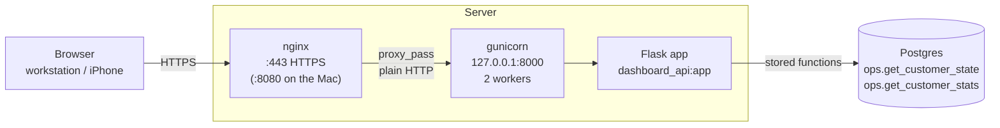
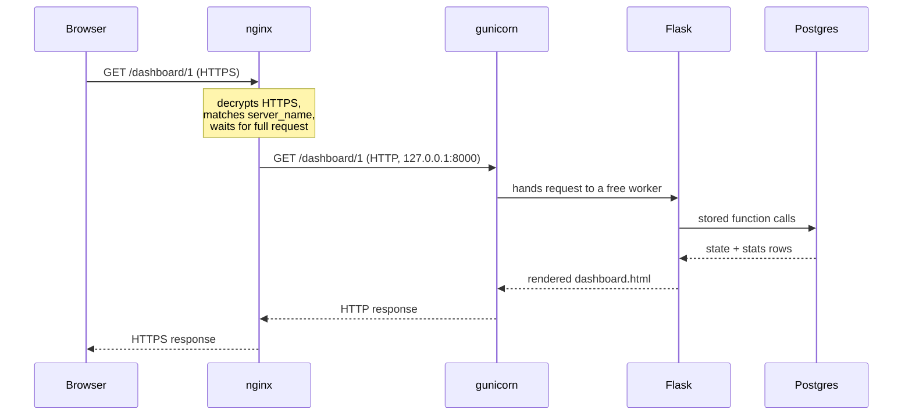

# Nginx Reverse Proxy

> [!info] Purpose
> This note explains **why** the dashboard runs behind nginx, **how**
> the pieces fit together, and **where** the routing from nginx to the
> Flask dashboard is configured.

## The short version

The dashboard is a Flask app (`dashboard_api.py`, object `app`). In
production it is not exposed to the internet directly. Three layers
each do one job:

| Layer | Job | Listens on |
|---|---|---|
| **nginx** | Faces the internet: HTTPS, slow clients, routing, access control | public port 443 (80 redirects to 443) |
| **gunicorn** | Runs the Python code in a few worker processes | `127.0.0.1:8000` — the machine itself only |
| **Flask** (`dashboard_api:app`) | Builds the pages from the stored functions | inside gunicorn |

## Architecture



Only nginx is reachable from outside. gunicorn binds to `127.0.0.1`,
so even if someone knows port 8000 exists, they can't reach it from
another machine.

## One request, step by step



## Why nginx?

gunicorn is good at one thing: running Python code. nginx handles
everything around it that faces the internet. gunicorn's own
documentation strongly recommends a proxy in front of it.

> [!important] Protection against slow clients
> gunicorn has a small, fixed number of workers (we run 2). A few
> visitors on a bad mobile connection, or someone doing it on purpose,
> can send requests so slowly that both workers are busy waiting, and
> the dashboard stops responding for everyone. nginx holds thousands of
> slow connections cheaply and only hands a request to gunicorn once it
> is complete, so workers only ever do real work.
>
> This is the reason that matters most on the public internet.

- **HTTPS / SSL** — nginx does the encryption; certbot (Let's Encrypt)
  obtains and renews the certificates. The Python process never deals
  with certificates.
- **One front door** — nginx owns ports 80 and 443 and routes by domain
  or path. A second service later is just another `server` block;
  gunicorn never runs as root or listens publicly.
- **Extras without code changes** — basic-auth login, rate limiting,
  blocking IP addresses, compression, access logs, a maintenance page
  while the app restarts.

## Where the routing is configured

All routing lives in **one `server` block** per site, in its own file
under the `servers/` (Mac) or `sites-available/` (Linux) folder. The
main `nginx.conf` only includes those files.

```nginx
server {
    listen 8080;                     # Mac; on the server: 443 ssl
    server_name localhost;           # which address this block answers

    location / {                     # every path ...
        proxy_pass http://127.0.0.1:8000;          # ... goes to gunicorn
        proxy_set_header Host $host;
        proxy_set_header X-Forwarded-For $proxy_add_x_forwarded_for;
        proxy_set_header X-Forwarded-Proto $scheme;
    }
}
```

| Line | What it does |
|---|---|
| `listen` | The port nginx accepts connections on. |
| `server_name` | nginx picks the `server` block whose name matches the address the visitor typed (the `Host` header). |
| `location /` | Applies to every path: `/`, `/dashboard/1`, … |
| `proxy_pass` | **The re-route itself**: forward the request to gunicorn. |
| `proxy_set_header …` | Pass on the original host, the visitor's IP address and whether they used HTTPS, which Flask would otherwise not see (it only sees nginx). |

> [!note] How nginx chooses a server block
> If no `server_name` matches the typed address, nginx falls back to the
> **default server** for that port (the first one loaded, or the one
> marked `default_server`). That is why, with Homebrew's welcome-page
> block still present, `localhost:8080` showed the dashboard but
> `127.0.0.1:8080` showed "Welcome to nginx!". On the production server
> this behavior is useful: a default block can reject requests for
> anything other than the real domain, e.g. bots scanning the bare IP.

The main `nginx.conf` is kept minimal:

```nginx
worker_processes  auto;              # one worker per CPU core

events {
    worker_connections  1024;
}

http {
    include       mime.types;
    default_type  application/octet-stream;

    sendfile           on;
    keepalive_timeout  65;

    include servers/*;               # one file per site
}
```

## Local (Mac) vs. production (server)

| | Mac | Server |
|---|---|---|
| nginx port | 8080 (no root needed) | 443 (HTTPS), 80 redirects |
| Main config | `/opt/homebrew/etc/nginx/nginx.conf` | `/etc/nginx/nginx.conf` |
| Site config | `servers/dashboard_api.local.conf` (symlink) | `sites-available/` + link in `sites-enabled/` |
| Started by | `brew services` | systemd (nginx + `dashboard.service`) |
| gunicorn | `gunicorn --chdir "${PROJECT_ROOT}" … dashboard_api:app` | same, in `ExecStart` of `dashboard.service` |
| SSL | optional, via `mkcert` | certbot / Let's Encrypt |
| Open in browser | `http://localhost:8080` | `https://<your domain>` |

## Config files live in the project

```
etc/
├── dashboard_api.env.example
└── nginx/
    ├── dashboard.local.conf    # Mac: port 8080, localhost
    └── dashboard.prod.conf     # server: real domain, SSL
```

The repo is the single source of truth. On the Mac, link instead of
copy, so edits take effect directly:

```bash
ln -s "${PROJECT_ROOT}/etc/nginx/dashboard.local.conf" \
      /opt/homebrew/etc/nginx/servers/dashboard.conf
```

> [!warning] certbot edits the config file
> `certbot --nginx` writes its SSL lines into the config on the server.
> If a deployment later copies the repo version over it, those lines
> disappear and HTTPS breaks. Either copy certbot's lines back into
> `dashboard.prod.conf` after the first run, or use `certbot certonly`
> and write the SSL lines in the repo file yourself.

> [!warning] Keep secrets out of git
> Real `.env` files and a future `htpasswd` file (basic-auth password
> hashes) stay on the machine only. The nginx config may safely refer to
> the `htpasswd` path.

## Everyday commands

| Task | Mac | Server |
|---|---|---|
| Check config | `nginx -t` | `sudo nginx -t` |
| Apply config changes | `brew services restart nginx` | `sudo systemctl reload nginx` |
| Full restart | `brew services restart nginx` | `sudo systemctl restart nginx` |
| Logs | `/opt/homebrew/var/log/nginx/` | `/var/log/nginx/`, `journalctl -u dashboard -f` |

Always run the config check first (`nginx -t && …`), so a typo can't
take nginx down.

## Troubleshooting

| Symptom | Cause | Fix |
|---|---|---|
| Port 8000 works, 8080 doesn't | Problem in the nginx config | `nginx -t`, check the log |
| Both 8000 and 8080 fail | App or gunicorn not running | Start gunicorn, check its output |
| "Welcome to nginx!" instead of the dashboard | Another `server` block answers first | Remove the default block from `nginx.conf` |
| `bind() … Address already in use` | nginx already runs (e.g. via `brew services`) | Use `brew services restart nginx`, don't start a second copy |
| gunicorn can't bind port 5000 on the Mac | macOS AirPlay Receiver uses port 5000 | Use port 8000 |

## See also

- [[Dashboard Architecture Overview]]
- [[Connecting to the Database]]
- [[Using ops_stats from a Python application]]
