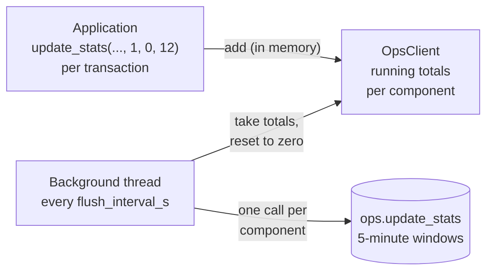

# Using `ops_stats` from a Python application

> [!info] Purpose
> This note explains how an application reports **state** (up, down or
> in planned maintenance) and **statistics** (events, errors, response
> time) into the dashboard's Postgres backend, using the `ops_stats`
> Python package (version **5.5.0** or later).

The application only reports raw facts, one transaction at a time.
Everything else happens elsewhere:

- **Aggregation** of transactions into batches happens inside the
  `OpsClient` object, in memory.
- **Windowing, averages and success rate** happen server-side, in the
  stored functions and at dashboard-read time.

There are two ways to call the package:

| Entry point | For | Stats are written |
|---|---|---|
| `OpsClient` | Applications and services (the normal case) | Aggregated, once per flush interval |
| `update_stats()` / `update_state()` | Scripts and occasional calls | Immediately, one write per call |

## Prerequisites

> [!warning] Before reporting anything
> - The `ops_stats` package (5.5.0 or later) is installed in the
>   application's Python environment.
> - `ops.customer` already has a row for the customer you report for
>   (e.g. `BlueFez`, `Platform42`), and `ops.component` has a row for
>   each customer + component type + component name combination (e.g.
>   `CHANNEL` / `WhatsApp`, `ORCHESTRATOR` / `Orchestrator`). Unknown
>   customers and components are never auto-created — see
>   [[Stored Function Design#update_stats]].
> - Connection details (`PGHOST`, `PGPORT`, `PGDATABASE`, `PGUSER`,
>   `PGPASSWORD`) are available via environment variables or a `.env`
>   file. See [[Connecting to the Database]].

## Applications: `OpsClient`

Create **one client at startup**, report **every transaction** as it
happens, and **close** the client when the program stops.

```python
from ops_stats import OpsClient

client = OpsClient(flush_interval_s=30)   # once, at startup

# per transaction: 1 event, 0 errors, 12 ms
client.update_stats("Platform42", "CHANNEL", "WhatsApp", 1, 0, 12)

client.close()                            # writes the last totals
```

### What happens behind the call



1. `update_stats()` adds the numbers to the running totals for that
   component (customer, type, name) and returns immediately. It never
   touches the database.
2. Every `flush_interval_s` seconds a background thread calls the
   stored function once per component with the totals, and resets the
   totals to zero.
3. The stored function adds the batch into the current 5-minute window.

> [!important] Counters never grow without bound
> Each flush starts a fresh set of totals, and a component that goes
> quiet disappears from memory until it reports again. Long-running
> programs can call `update_stats()` indefinitely.

### Parameters

```python
client.update_stats(
    customer_name="Platform42",
    component_type="CHANNEL",
    component_name="WhatsApp",
    total_events=1,
    total_errors=0,
    total_response_time_ms=12.0,
)
```

| Parameter | Meaning |
|---|---|
| `customer_name` | Must match an existing row in `ops.customer`. |
| `component_type` | e.g. `"CHANNEL"`, `"ORCHESTRATOR"`. Must match `ops.component`. |
| `component_name` | e.g. `"WhatsApp"`, `"Instagram"`, `"Orchestrator"`. Must match `ops.component`. |
| `total_events` | Events in **this call** — normally `1` (one transaction). |
| `total_errors` | How many of those failed — normally `0` or `1`. |
| `total_response_time_ms` | Response time of this transaction; for a multi-event call, the **sum**. |

> [!note] Batches still work
> Passing several events in one call (e.g. `10, 1, 140.0`) is fine; the
> client adds them up the same way. `total_response_time_ms` is always
> a **sum**, never an average: the dashboard derives the average as
> `total_response_time_ms / total_events` at read time. See
> [[Stats Windowing and Resets]] for why averages can't be accumulated.

### Choosing `flush_interval_s`

Default: **30 seconds**. Rule: **at most 1/10 of the server's stats
window** (5 minutes → 30 s).

> [!important] Why not half the window?
> This is not a sampling problem: no event is ever lost, only delayed.
> The server stamps a batch with the time it **arrives**, so a
> transaction that waits in the client across a window boundary is
> counted in the next window. On average events wait half the
> interval, so roughly `(flush_interval_s / 2) / window` of them shift:
>
> | `flush_interval_s` | Events shifted into the next window |
> |---|---|
> | 30 s (1/10) | ~5% |
> | 150 s (1/2) | ~25% |

### Guarantees

| Situation | Behavior |
|---|---|
| Normal call | Returns at once; never waits on the database, never raises database errors. |
| Database unreachable | Totals are kept and retried at the next flush (summed with new transactions, so memory stays one set per component). A warning is logged. |
| Batch rejected (e.g. unknown component) | Logged as an error and **dropped** — retrying cannot succeed. Check the log after adding new components. |
| `close()`, end of `with` block, normal exit | Remaining totals are written. |
| Hard crash | At most one interval of stats is lost. |
| Several threads | Safe: threads may share one client. |
| Forking servers (gunicorn) | Create one client **per worker, after the fork** — the background thread doesn't survive a fork. |

> [!warning] Unknown components are logged, not raised
> Because aggregated writes happen in the background, a misspelled
> customer or component name does **not** raise in the application. It
> shows up as an `ops_stats: dropped stats …` error in the log. Make
> sure the application's logging is configured so these are visible.

## Full example: a service reporting per transaction

```python
import logging
import time

from ops_stats import OpsClient

logging.basicConfig(level=logging.INFO)   # makes ops_stats warnings visible

client = OpsClient(flush_interval_s=30)   # once, at startup


def handle_message(message):
    start = time.perf_counter()
    errors = 0
    try:
        process(message)                  # the actual work
    except Exception:
        errors = 1
        raise
    finally:
        elapsed_ms = (time.perf_counter() - start) * 1000
        client.update_stats("Platform42", "CHANNEL", "WhatsApp", 1, errors, elapsed_ms)


try:
    run_main_loop(handle_message)         # however the program receives work
finally:
    client.close()                        # writes the last totals
```

- The inner `finally` counts every transaction, failed ones included
  (`errors=1`).
- The outer `finally` writes the last totals when the program stops.
- `time.perf_counter()` is the right clock for durations: precise and
  unaffected by system clock changes.
- One client serves all components: pass different names, and the
  client keeps separate totals per component.

For a short program, the `with` form does the same:

```python
with OpsClient(flush_interval_s=30) as client:
    for message in messages:
        ...
        client.update_stats("Platform42", "CHANNEL", "WhatsApp", 1, 0, 12)
```

> [!tip] Simulating traffic for a test
> ```python
> import random, time
> from ops_stats import OpsClient
>
> with OpsClient(flush_interval_s=30) as client:
>     for _ in range(10_000):
>         errors = 1 if random.random() < 0.05 else 0   # 5% errors
>         response_ms = random.uniform(5, 50)
>         client.update_stats("Platform42", "CHANNEL", "WhatsApp", 1, errors, response_ms)
>         time.sleep(0.01)                               # ~100 per second
> ```
> The dashboard's success rate should hover around 95%. Add
> `random.seed(42)` for a repeatable run.

## Reporting state: `update_state`

State is **not aggregated**: every call is written immediately, on the
client or as a one-shot function.

```python
client.update_state("Platform42", "ORCHESTRATOR", "Orchestrator", available=True)

# planned maintenance: shown gray instead of red
client.update_state("Platform42", "ORCHESTRATOR", "Orchestrator",
                    available=False, planned_shutdown=True)
```

| Parameter | Meaning |
|---|---|
| `customer_name` | Same matching rule as `update_stats`. |
| `component_type` / `component_name` | Same matching rule as `update_stats`. |
| `available` | `True` = up, `False` = down. |
| `planned_shutdown` | Optional, **keyword-only**, default `False`. Set to `True` together with `available=False` when the component was stopped on purpose (planned maintenance). |

### Resulting state

| Call | Stored state | Dashboard |
|---|---|---|
| `available=True` | `'UP'` | Green, up arrow |
| `available=False` | `'DOWN'` | Red, down arrow — abnormal end (ABEND) |
| `available=False, planned_shutdown=True` | `'MAINTENANCE'` | Dark gray, pause sign — planned shutdown |

> [!important] DOWN means ABEND unless you say otherwise
> A component that reports `available=False` without
> `planned_shutdown=True` is treated as an **abnormal end** and shows
> red. Only an explicit planned shutdown turns it gray. Gray means the
> component still belongs to the domain we guard, but nobody needs to
> react to it.

> [!note] Rules around `update_state`
> - `planned_shutdown` is **keyword-only**: `update_state(..., False, True)`
>   raises a `TypeError`. Always write `planned_shutdown=True`.
> - `available=True, planned_shutdown=True` is meaningless and raises a
>   `ValueError`. The stored function enforces the same rule.
> - Unlike `update_stats` on a client, `update_state` **raises**
>   database errors (e.g. unknown component), because it writes
>   immediately.
> - Leaving maintenance needs no special call: the next
>   `update_state(..., available=True)` overwrites the state with `'UP'`.

Unlike stats, state is **not windowed** — there's no history of past
states, just the current value, overwritten on every call. See
[[State vs Stats Architecture]] for why these two are modeled so
differently.

## Scripts: one-shot functions

For occasional calls (a script, a cron job, a webhook handler) the
module-level functions open a connection, write immediately, and close.
There is **no aggregation**: each call is one database write, and
database errors are raised.

```python
from ops_stats import update_stats, update_state

# a batch of 3 WhatsApp messages, 1 error, response times summed
update_stats("Platform42", "CHANNEL", "WhatsApp", 3, 1, 180.0)

update_state("Platform42", "ORCHESTRATOR", "Orchestrator",
             available=False, planned_shutdown=True)
```

> [!warning] Don't use the one-shot `update_stats` per transaction
> Every call opens a database connection. For per-transaction
> reporting in a running program, always use `OpsClient`.

## What the application never has to think about

- Adding up transactions — `OpsClient` aggregates per component and
  resets its totals after every flush.
- When to write to the database — the background thread does it once
  per interval, and again on close.
- Which time window a stats report lands in — the stored function
  works that out from `now()`.
- Resetting server-side counters — there's no reset call; a new window
  simply starts a fresh row.
- Computing averages or success rates — those are derived at
  dashboard-read time.
- Whether a component "only" reports state or "only" reports stats —
  it just calls whichever applies; the dashboard's read side handles
  the rest. See [[State vs Stats Architecture]].
- Clearing a maintenance state — reporting `available=True` again is
  enough.

## See also

- [[Stored Function Design]]
- [[Stats Windowing and Resets]]
- [[State vs Stats Architecture]]
- [[Dashboard Architecture Overview]]
- [[Nginx Reverse Proxy]]
